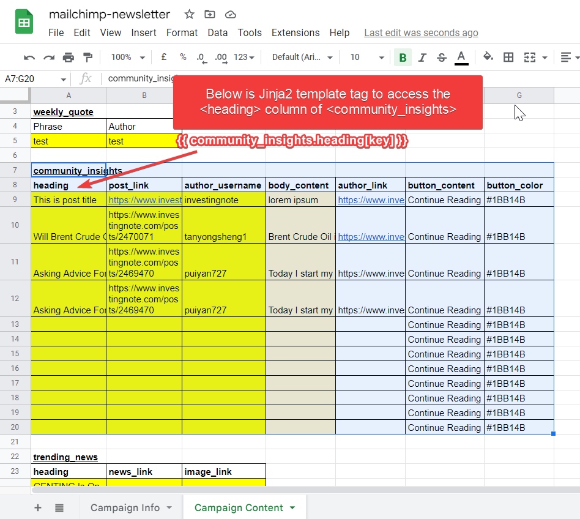

# mailchimp_auto

## Welcome to chronos’s documentation!
`mailchimp_auto` is a command line application to automate the email creation process on MailChimp based on the google spreadsheet input. What it does is using Jinja2 template engine to loop over dummy values (e.g., website url, image url, string) on html template in order to create the html template to be uploaded to MailChimp server.

(Note: This project is highly customized for personal use, but it's okay for reference.)

## Introduction
This package uses 2 major packages:
* mailchimp-marketing to automate creating campaign on Mailchimp
* jinja2 for managing tags inserted into the HTML email template to loop over and replace the data elements

----
## Motivation
As a newbie hobbyist in Python, I found it very troublesome to drag and drop the editor in MailChimp in a weekly basis just to change some certain contents in the template that wastes me 30 minutes per change, thus I need a way to automate that campaign creation.

----
## Getting Started

* `pip install mailchimp_auto`

---
## Configuration
### Account Configuration
Before you start using this cli tool, you should setup Mailchimp API, Mailchimp server prefix, Google Service account's json file through the command line `mailchimp_auto config` or `python -m mailchimp_auto config`.

And after the command has been run, the interface below will appear:

```
Current Mailchimp remote:
Account Username        Server Prefix
=================       =============
TYONGSHENG               us1

e) Edit existing account
n) New account
d) Delete account
q) quit
e/n/d/q > e
```

You are required to create (n), edit(e) the config variables such as mailchimp username, mailchimp API, and fill in the Google Service Account Credentials JSON path that you have downloaded. 

```
Select account.
Choose a number from below, or type in an existing value.
1 >  TYONGSHENG
Account > 1

Mailchimp API
Enter a string value. Press Enter for the default (2exxxxxxxxxxxxxxxxxxxxxxxx-us1): 2exxxxxxxxxxxxxxxxxxxxxxxx-us1

Service_account_file.
Google Service Account Credentials JSON file path.
Enter a string value. Press Enter for the default (C:\Users\tys\Documents\mailchimp-auto\.config\service_account_file\TYONGSHENG.json): C:\Users\tys\Documents\mailchimp-auto\.config\service_account_file\TYONGSHENG.json
```

For how to open a Google service account and download its JSON key, follow Step 1 to Step 5 [here](https://owaisqureshi.medium.com/access-google-sheets-api-in-python-using-service-account-3a0c6d89d5fc). 


Feel free to delete (d) any entry you don't need anymore!

### Template Configuration
Type the command line `mailchimp_auto config-template` or `python -m mailchimp_auto config-template` to upload and save the HTML email template (in form of Jinja tags) to this program and also setup spreadsheet (using spreadsheet url) to get the data you want to parse or loop into the HTML email template. 

```
Current template(s):
Template                        Spreadsheet Id
========                        ===============
my_weekly_newsletter             1h31GQRfBqUpMmPCXI013J1-Y-kinfgifN6Pa3dx3hB0


e) Edit existing template
n) New template
d) Delete template
q) quit
e/n/d/q > e
```

But, before continue to enter any input into it, please prepare the few things below:

(i) Create an google spreadsheet with two pages, "Campaign Info" and "Campaign Content". You can refer to the sample spreadsheet [here](https://docs.google.com/spreadsheets/d/1h31GQRfBqUpMmPCXI013J1-Y-kinfgifN6Pa3dx3hB0/edit?usp=sharing), whereby the data there are to be scraped through this program to be processed into the HTML email template to replace the dummy variables I have placed using Jinja2 library module. 

(ii) Then, create an Jinja2 email template (`master.htm`) inside a folder. 

Here are some simple Jinja template tags in order to create the Jinja2 email template (can skip this if you already know) or see [here](https://jinja.palletsprojects.com/en/3.1.x/templates/) if you want to know more: 
* {{ ... }} for Expressions to print to the template output
*  for Statements

So, for example, referring to the [spreadsheet](https://docs.google.com/spreadsheets/d/1h31GQRfBqUpMmPCXI013J1-Y-kinfgifN6Pa3dx3hB0/edit?usp=sharing), if you want to parse the `community_insights` table variable int, below is the sample Jinja2 template tags:

```html

    <p>Any html content you want to loop can put it here</p>
    <p>And here is the dynamic variable here: {{ community_insights.heading[key] }}</p>

```


For the template folder structure, you can refer here, whereby `master.htm` is the COMPULSORY file to have when generating html email output (refer to [sample template folder](sample_template) ): 
```
template
\---<your template name>
    |   master.htm
```
Tips: For me, I export the HTML email template from the MailChimp and then edit the HTML file through replacing the Jinja2 template tags onto some variables which I wish to loop the data into them.

(iii) Continue back to the command line `mailchimp_auto config-template` and then do follow the following series of instructions: 

Below are the commands when I want to edit (e) some config of my template. It does the same when you want to create (n) a new template source. 
```
Current template(s):
Template                        Spreadsheet Id
========                        ===============
my_weekly_newsletter             1h31GQRfBqUpMmPCXI013J1-Y-kinfgifN6Pa3dx3hB0

e) Edit existing template
n) New template
d) Delete template
q) quit
e/n/d/q > e

Select template.
Choose a number from below, or type in an existing value.
1 >  my_weekly_newsletter
Template > 1

Template folder.
The file path of the HTML email template folder.
Enter a string value. Press Enter for the default (C:\Users\tys\Documents\mailchimp-auto\template\my_weekly_newsletter): C:\Users\tys\Documents\Project\mailchimp_creation_project\mailchimp-auto\sample_template

Spreadsheet url.
The Google spreadsheet url that you want to parse it to the Jinja2 HTML email template: .
Enter a string value. Press Enter for the default (https://docs.google.com/spreadsheets/d/1h31GQRfBqUpMmPCXI013J1-Y-kinfgifN6Pa3dx3hB0/edit#gid=1758545491): https://docs.google.com/spreadsheets/d/1h31GQRfBqUpMmPCXI013J1-Y-kinfgifN6Pa3dx3hB0/edit#gid=1758545491

Worksheet Title of Campaign Info.
The worksheet title of campaign info: .
Enter a series of cell ranges, separated by symbol (,). Press Enter for the default (Campaign Info): *Campaign Info*

Campaign Info.
The Campaign info that you want to parse it to the Jinja2 HTML email template: .
Enter a series of cell ranges, separated by symbol (,). Press Enter for the default (A1:B8): *A1:B8*

Worksheet Title of Campaign Content.
The worksheet title of campaign content: .
Enter a series of cell ranges, separated by symbol (,). Press Enter for the default (Campaign Content): Campaign Content

Campaign Content.
The Campaign Content that you want to pass it to the Jinja2 HTML email template: .
Enter a series of cell ranges, separated by symbol (,). Press Enter for the default (A3:B5,A7:G20,A22:C31,A33:D41,A43:G48): A3:B5,A7:G20,A22:C31,A33:D41,A43:G48
```


## Running the program to automate the campaign creation
Enter the command line `mailchimp_auto create --user <mailchimp_account_username> --template <your_template>` and then it will scrape data from Google Spreadsheet you assigned to and inserted them into the HTML email template to loop over and replace the data elements. 

If you don't want to upload your processed HTML email template to mailchimp server first, add the command `--preview` behind the previous command line, e.g.,   `mailchimp_auto create --user <mailchimp_account_username> --template <your_template> --preview`.

It's all done. Hope you are successful with that. If got any problem, kindly contact me. By the way, this is my first time creating a python library (or cli tool) to automate my task. I know some python syntax works not the best for the program (e.g., too much repetitive code, etc). But, I hope I could learn more through creating and maintaining this program.

## Other information
```

 Usage: mailchimp_auto [OPTIONS] COMMAND [ARGS]...

╭─ Options ────────────────────────────────────────────────────────────────────────╮
│ --install-completion          Install completion for the current shell.          │
│ --show-completion             Show completion for the current shell, to copy it  │
│                               or customize the installation.                     │
│ --help                        Show this message and exit.                        │
╰──────────────────────────────────────────────────────────────────────────────────╯
╭─ Commands ───────────────────────────────────────────────────────────────────────╮
│ config           Setup Mailchimp API, Mailchimp server prefix, Google Service    │
│                  account's json file, MUST SETUP this first before running this  │
│                  program                                                         │
│ config-file      To check your account config file, either account config file   │
│                  or template config file.                                        │
│ config-template  Setup Google spreadsheet, campaign info and its email content.  │
│ create           Upload html email template to mailchimp server and create a     │
│                  campaign.                                                       │
╰──────────────────────────────────────────────────────────────────────────────────╯

```